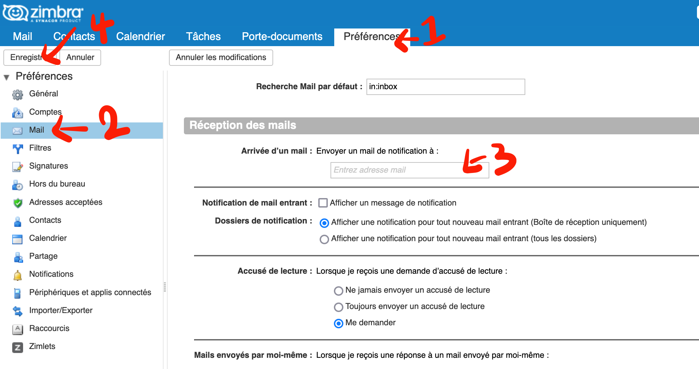

Ce document est à destination des étudiants et des intervenants du MS MISL.

# Calendrier du MISL

Le calendier du MISL est disponible publiquement via [ici](https://webmail.mines-paristech.fr/home/arthur.gaudron@mines-paristech.fr/MISL.html) :link:.

Vous pouvez ajouter le calendrier à votre agenda électronique via : 
- ICS:    [https://webmail.mines-par...n@mines-paristech.fr/MISL.ics](https://webmail.mines-paristech.fr/home/arthur.gaudron@mines-paristech.fr/MISL.ics)
- Outlook:  [webcals://webmail.mines-p...n@mines-paristech.fr/MISL](webcals://webmail.mines-paristech.fr/home/arthur.gaudron@mines-paristech.fr/MISL)

**Pour les intervenants**

En amont de votre intervention, vous receverez une invitation directement à l'adresse email que nous avez communiqué.

# Cours à distance

Les cours à distance sont exceptionnels et soumis à autorisation.

Pour rejoindre un cours sur zoom :
1. Accédez au calendrier  https://webmail.mines-par...n@mines-paristech.fr/MISL.html
2. Repérez la salle de cours renseignée dans « Emplacement » (en général nous sommes en L228)
3. Rendez-vous sur https://salles-zoom.mines-paristech.fr/ pour trouver votre salle et lancer Zoom.

:triangular_flag_on_post: **Attention** :triangular_flag_on_post:
- Si la salle n'apparaît pas sur ce site, vous trouverez le lien sur le calendrier MISL dans les notes.
- Les liens changent tous les jours, il faut toujours de référer au site https://salles-zoom.mines-paristech.fr/

**Pour les intervenants**
- Le code du cadenas est 9137 ou 137.
- L'identifiant et le mot de passe sont inscrits sur la base de l'écran.
- Un port USB est disponible sur la tranche gauche de l'écran.
- Le mode d'emploi du matériel est affiché dans la salle et il est disponible [ici](media/Tuto_hybride_Paris-V2.pdf).
- Le numéro de l'assistance (service audiovisuel) est 01 40 51 91 37.

# Webmail

L'e-mail est un outil essentiel pour le partage d'informations au cours de votre scolarité. En tant qu'étudiant, vous devez régulièrement consulter le webmail ou d'activer les notifications.

Pour activer les notifications, il suffit de suivre le tutoriel ci-dessous.

