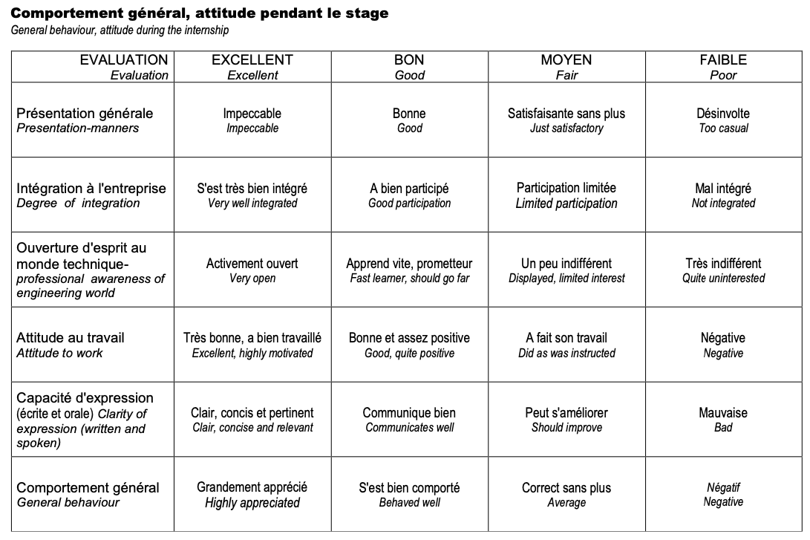
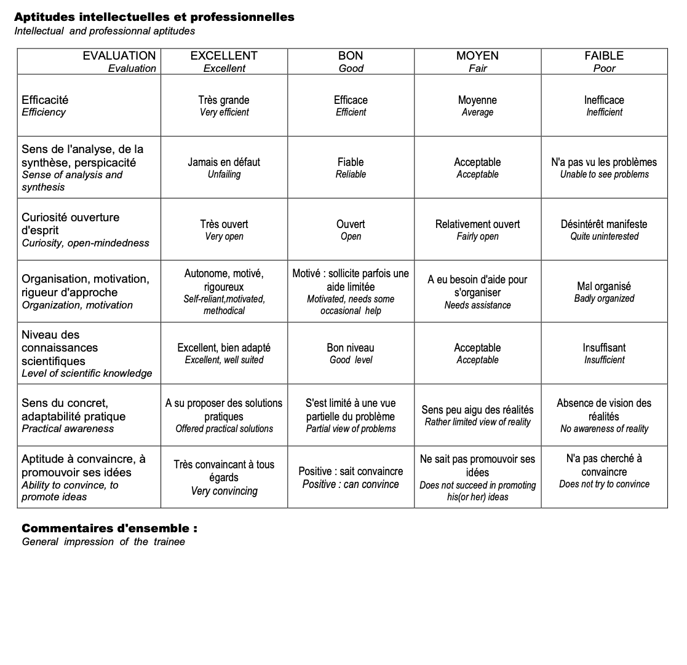

Ce document est à destination des étudiants et des intervenants du MS MISL.

L'évaluation de votre mission industrielle se base sur :
- le mémoire de thèse professionnelle
- la soutenance de votre thèse professionnelle
- les appréciations de vos tuteurs académiques et industrielles
- le rapport de stage

# Le mémoire de thèse professionnelle

Pré-requis de la CGE

C'est un travail scientifique

# La soutenance

# Le rapport de mission

D'une part, ce rapport est utilisé par l'équipe pédagogique du recul que vous avez pris sur votre travail. D'autre part, c'est un source d'informations importantes pour les promotions futures.

- Date butoir : 15 septembre 2022
- Format : PDF via le lien
- Intitulé du fichier : NOM Prénom rapport mission 2022

Modèle : téléchargez ici avec la page de garde (nom, prénom, déroulé de la césure (entreprise ou projet, lieu, dates),

## 1ère partie — Prise de recul sur la mission industrielle

Présentation rapide de l'entreprise, de l'équipe et du service.

Description de la ou des mission(s) confiée(s) et des motivations initiales.

Prise de recul sur l'ensemble des missions confiées en termes de compétences : professionnelles (scientifiques, techniques, transversales...), organisationnelles, méthodologiques...

Prise de recul sur le savoir-être professionnel :
    communication, adaptabilité, force de persuasion, gestion du stress, travail en équipe, persévérance, réactivité, autonomie, rigueur, polyvalence, force de propositions, écoute, capacité de synthèse, curiosité, prise d’initiatives.

Prise de recul sur le secteur d’activité :
   - Intérêt de la mission,
   - Degré d'investissement personnel,
   - Points positifs du stage,
   - Difficultés rencontrées et méthodologie de résolution de problèmes,
   - Prise de recul sur le télétravail (si applicable)

Prise de recul sur le management / encadrement de l’entreprise / RH
   - Style de management (directif, persuasif, participatif, délégatif, paternaliste...), ➢ Travail en équipe,
   - Rapport à la hiérarchie,
   - Rapport au temps (gestion des priorités, rythme et charge de travail...),
   - Distance relationnelle entre collègues,
   - Qualité de l'encadrement,
   - Flexibilité dans le travail,
   - Conditions de travail,
   - Indemnités / Rémunération / Avantages en nature,

Prise de recul sur la culture d’entreprise 
   - Valeurs fortes de l'entreprise,
   - Politique RSE,
   - Croyances,
   - Rituels, 
   - Parité, 

Prise de recul sur la culture du pays (si le stage s'effectue pour une entreprise étrangère ou pour une entreprise française qui se trouve à l'étranger).

Conclusion
              
## 2nde partie — Construction du projet professionnel

Projections en termes de projet professionnel à court terme
   - Bilan personnel des prises de conscience professionnelle (« ce que j’aime, ce que je n’aime pas » en termes de missions, d’environnement de travail, de secteurs d’activité...),
   - Projections en termes de projet professionnel à court terme (1er job) : secteurs d'activité, fonctions, métiers, postes, taille d’entreprise (start-up / PME / ETI / grande entreprise), lieux (Idf, Province, Europe, Hors Europe...),
   - Plan d’actions à mettre en place pour préparer son insertion professionnelle (entretiens réseau, formations ou Mooc complémentaires, stage de fin d’études...).

Projections en termes de trajectoire de carrières à moyen terme

Conclusion

## 3ème partie — Conseils pour les stagiaires à venir

Recherche de stage
- Quand démarrer la prospection ?
- Quels canaux : plateformes (Jobteaser, Indeed, Welcome to the Jungle, Going Global...), césuriens, alumni, sites des entreprise... ?
- Quelle est la durée moyenne des process de sélection ?
- Quels sont les modes de sélection : entretiens techniques, entretiens RH, tests écrits, vidéo de présentation... ?
- Quels types de questions spécifiques lors de l’entretien ? 

Travail en entreprise
- Quels conseils pour bien s’intégrer ?
- Comment trouver un bon fonctionnement avec son tuteur en entreprise ?
- En cas de problème, qui solliciter, quelles ressources pour trouver une solution... ?
- Vie personnelle en dehors du stage
- En cas de stage à l’étranger, comment trouver un logement, quelles démarches pour les demandes de visa... ?

Conclusion

## 4ème partie — Conclusion générale

Revenez sur les points marquants de votre rapport et de votre mission.

# Les appréciations des tuteurs

La fiche d'évaluation est segmentée en deux parties pour apprécier d'une part le comportement général et d'autre par les aptitudes intellectuelles et profesionnelles.

