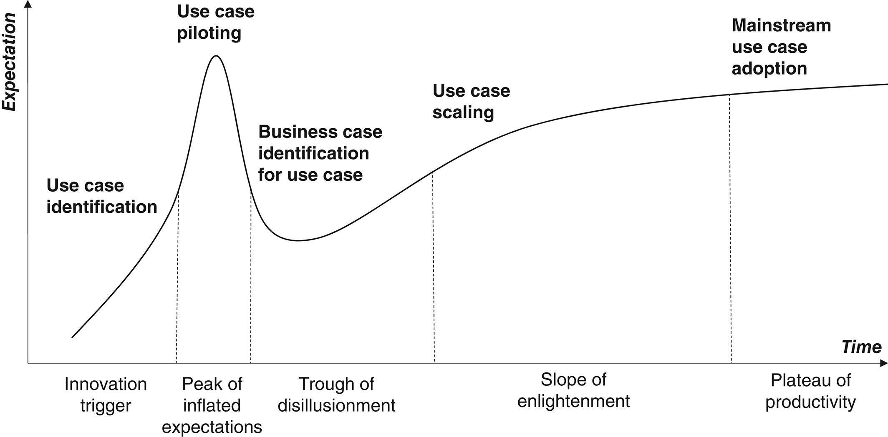

> Maghazei, Omid, Michael A. Lewis, et Torbjørn H. Netland. « Emerging Technologies and the Use Case: A Multi-Year Study of Drone Adoption ». Journal of Operations Management 68, no 6 7 (2022): 560 91. https://doi.org/10.1002/joom.1196.

# Introduction

## Industry 4.0

 - direct digital manufacturing (DDM) or 3D printing
 - artificial intelligence
 - unmanned aerial systems (UAS) or drones
 - blockchain
 - RFID
 - VR/AR/XR
 - etc.

## Emergence and spread of an innovation
- DDM is limited to tasks such as prototyping, “soft tooling,” and the on-demand production of customized and spare parts due to high costs

- Drones are used in experimentations and in production : oil platforms inspection (Shell), medical products delivery (Zipline), continual inventory control in its warehouses (IKEA)

# Theoritical framework

## Advanced manufacturing technology (AMT)

"AMT, which could “control, track, or monitor manufacturing activities, either directly or indirectly” (Boyer et al., 1997, p. 332)"

"A key theme in the AMT literature (e.g., Jaikumar, 1986; Meredith, 1987; Upton, 1995) was that the challenge of realizing benefits was not a problem “in the technology itself, even though it is new and unstable” (Hayes & Jaikumar, 1991, p. 170) but, instead, was determined by the appropriateness of associated decisions and processes—primarily in terms of the technologies' fit or match with a range of internal and external contingencies."

## Three types of fits in the classic AMT literature. 

These are the fit between the technology and 

 1. economic and strategic factors, 
 2. operational and supply chain factors, and 
 3. organizational and behavioral factors.

## Technological fit with economic and strategic factors

"Creating “a business case” is critical to this phase, which means identifying and comparing measurable benefits and costs of the technology option (Burcher et al., 1999)."
- "Managers calculate or estimate economic potential using project finance techniques"
- "AMT researchers have long stressed the limitations of any overreliance on narrow capital budgeting-centered approaches."

It may be truer for infrastructure technologies that have many direct and indirect outcomes (both positive or negative)

Das and Narasimhan (2001, p. 539) reported that “the use of AMT … does not appear to encourage firms to assume ‘off diagonal’ positions in the Hayes and Wheelwright (1979) framework.” (Hayes, R. H., & Jaikumar, R. (1991). Requirements for successful implementation of new manufacturing technologies. Journal of Engineering and Technology Management, 7(3–4), 169–175. )

Hayes and Jaikumar (1991, p. 173) argued for a form of options-based appraisal (cf. Pandza et al., 2003), given that many AMT benefits cannot be defined until after the knowledge they create has been assimilated: “Investments in new technology often resemble the ante in a poker game. One does not expect any direct return from the ante itself. It simply allows one to play the next set of cards.”

**off-diagonal**

“We find that—when faced with fast-emerging technologies in thriving ecosystems—companies do not follow a linear technology adoption pattern, where adoption commonly starts with a business case. Instead, companies trial technologies by focusing on a “use case,” which allows a potential business case to evolve, or not, over time.”

## Technological fit with operational and supply chain factors

how the technology integrates with the firms' operating model (Frohlich & Dixon, 1999; Leonard-Barton & Deschamps, 1988; Tyre & Orlikowski, 1994)

This can be particularly challenging if the process affects routines, responsibilities, and reporting channels (Meredith, 1987).

In the classic AMT literature (e.g., computer-aided manufacturing, flexible manufacturing systems, etc.) were mainly developed for specific manufacturing applications. 
- the role of supply systems has been under-investigated.
- In areas where research has been conducted (e.g., Bessant, 1994), it has been suggested that suppliers perceived most of their buyers (i.e., the manufacturing firms) as unsophisticated customers
- This buyer–supplier knowledge gap would only exacerbate the challenge of operational fit.

## Technological fit with organizational and behavioral factors

If any new technology is to be fully implemented, it will require acceptance by users (e.g., Venkatesh & Davis, 2000)
- technology adoption process (Waldeck & Leffakis, 2007). 
- training is key 

In change management, there is more than training 
- More recent literature examines the managerial behavioral aspects of technology adoption (e.g., Bendoly & Cotteleer, 2008; **Loch, 2017**; Roscoe et al., 2019)

# Field of study

## Drones are not a traditional AMT
- not intended for manufacturing applications (leisure and military)
- flying is unprecedent in factory : open new possibilities but with constraints (flight time, payload, wind turbulence, noise, safety, privacy)
- flexibility of the on-board equipment (cameras, sensors, and robotic arms)
- users are familiar with the technology

## #1 Fit with economic and strategic factors

The business case for drones remains unclear compared with traditional investment options such as forklifts, mounted cameras, and material handling systems.

## First law of technology

“overestimate[ing] the short-term impact of a truly transformational discovery, while underestimating its longer-term effects.” Collins (2010) 

See also : Brynjolfsson, Erik, Daniel Rock, et Chad Syverson. « The Productivity J-Curve: How Intangibles Complement General Purpose Technologies ». American Economic Journal: Macroeconomics 13, nᵒ 1 (janvier 2021): 333‑72. https://doi.org/10.1257/mac.20180386.

## Exploration vs. Exploitation

## #2 Fit with operational and supply chain factors

Market pull versus technology push (Mowery & Rosenberg, 1979; Nemet, 2009)

 - drones, were developed for non-OM applications and are being pushed onto OM problems
 -  it is often unclear whether a problem needs a technological solution or a technology seeks a problem to resolve

## Drone technology ecosystems

One way to address a low perceived fit between emerging technologies and internal operational factors might be to outsource development and deployment to specialized suppliers.

The vivid drone startup industry is actively looking for development partners, implementation pilot projects, and potential customers.

## #3 Fit with organizational and behavioral factors

New technology

 - no organizational structures
 - require extensive training

Automation raise the employment question

Creates risks

Negative opinion about the tech

# Research question

- Drones do not appear to have favorable starting conditions for achieving a fit with any of the three factors.

- Why then do companies continue to explore and pilot drones in their operations, and how do companies move from early ideas to matured applications?

# Methodology

This research is a multi-year analysis of drone applications in OM.

It takes particular inspiration from Pettigrew's longitudinal case research method (e.g., Pettigrew, 1985, 1990; Pettigrew et al., 2001) and Langley's process studies (e.g., Langley et al., 2013; Langley & Truax, 1994).

Case studies are useful when exploring questions about the “why” and “how” of concepts (Yin, 2013)

# Findings 

## Case studies

<table class="tg">
<thead>
  <tr>
    <th class="tg-wa1i">Theoretical themes</th>
    <th class="tg-wa1i">Study 1: Explorative study of drone applications in operations (2016–2018)</th>
  </tr>
</thead>
<tbody>
  <tr>
    <td class="tg-cly1">Economic and strategic factors  (Poor fit)</td>
    <td class="tg-0lax">Scarce evidence of drone implementation but a considerable amount of “piloting” &nbsp;&nbsp;&nbsp;&nbsp;&nbsp;&nbsp;&nbsp;&nbsp;&nbsp;&nbsp;&nbsp;&nbsp;&nbsp;&nbsp;&nbsp;&nbsp;&nbsp;&nbsp;&nbsp;&nbsp;&nbsp;&nbsp;&nbsp;&nbsp;&nbsp;&nbsp;&nbsp;&nbsp; Poor evidence of ROI for OM applications &nbsp;&nbsp;&nbsp;&nbsp;&nbsp;&nbsp;&nbsp;&nbsp;&nbsp;&nbsp;&nbsp;&nbsp;&nbsp;&nbsp;&nbsp;&nbsp;&nbsp;&nbsp;&nbsp;&nbsp;&nbsp;&nbsp;&nbsp;&nbsp;&nbsp;&nbsp;&nbsp;&nbsp; “Use case,” not business case &nbsp;&nbsp;&nbsp;&nbsp;&nbsp;&nbsp;&nbsp;&nbsp;&nbsp;&nbsp;&nbsp;&nbsp;&nbsp;&nbsp;&nbsp;&nbsp;&nbsp;&nbsp;&nbsp;&nbsp;&nbsp;&nbsp;&nbsp;&nbsp;&nbsp;&nbsp;&nbsp;&nbsp; Drone piloting seen as technology championing, sponsored by earmarked “Industry 4.0” funds &nbsp;&nbsp;&nbsp;&nbsp;&nbsp;&nbsp;&nbsp;&nbsp;&nbsp;&nbsp;&nbsp;&nbsp;&nbsp;&nbsp;&nbsp;&nbsp;&nbsp;&nbsp;&nbsp;&nbsp;&nbsp;&nbsp;&nbsp;&nbsp;&nbsp;&nbsp;&nbsp;&nbsp; Drone startups actively seeking co-development partners and willing to conduct pilots at low cost or for free&nbsp;&nbsp;&nbsp;&nbsp;&nbsp;&nbsp;&nbsp;&nbsp;&nbsp;&nbsp;&nbsp;&nbsp;&nbsp;&nbsp;&nbsp;&nbsp;&nbsp;&nbsp;&nbsp;&nbsp;&nbsp;&nbsp;&nbsp;&nbsp;&nbsp;&nbsp;&nbsp;&nbsp;</td>
  </tr>
  <tr>
    <td class="tg-cly1">Operational and supply chain factors (Poor fit)</td>
    <td class="tg-0lax">Fast developing technology &nbsp;&nbsp;&nbsp;&nbsp;&nbsp;&nbsp;&nbsp;&nbsp;&nbsp;&nbsp;&nbsp;&nbsp;&nbsp;&nbsp;&nbsp;&nbsp;&nbsp;&nbsp;&nbsp;&nbsp;&nbsp;&nbsp;&nbsp;&nbsp;&nbsp;&nbsp;&nbsp;&nbsp; Significant hype &nbsp;&nbsp;&nbsp;&nbsp;&nbsp;&nbsp;&nbsp;&nbsp;&nbsp;&nbsp;&nbsp;&nbsp;&nbsp;&nbsp;&nbsp;&nbsp;&nbsp;&nbsp;&nbsp;&nbsp;&nbsp;&nbsp;&nbsp;&nbsp;&nbsp;&nbsp;&nbsp;&nbsp; Limited functionality reduces use case options &nbsp;&nbsp;&nbsp;&nbsp;&nbsp;&nbsp;&nbsp;&nbsp;&nbsp;&nbsp;&nbsp;&nbsp;&nbsp;&nbsp;&nbsp;&nbsp;&nbsp;&nbsp;&nbsp;&nbsp;&nbsp;&nbsp;&nbsp;&nbsp;&nbsp;&nbsp;&nbsp;&nbsp; Easy to run stand-alone pilot projects without technology integration &nbsp;&nbsp;&nbsp;&nbsp;&nbsp;&nbsp;&nbsp;&nbsp;&nbsp;&nbsp;&nbsp;&nbsp;&nbsp;&nbsp;&nbsp;&nbsp;&nbsp;&nbsp;&nbsp;&nbsp;&nbsp;&nbsp;&nbsp;&nbsp;&nbsp;&nbsp;&nbsp;&nbsp; Importance of ecosystem&nbsp;&nbsp;&nbsp;&nbsp;&nbsp;&nbsp;&nbsp;&nbsp;&nbsp;&nbsp;&nbsp;&nbsp;&nbsp;&nbsp;&nbsp;&nbsp;&nbsp;&nbsp;&nbsp;&nbsp;&nbsp;&nbsp;&nbsp;&nbsp;&nbsp;&nbsp;&nbsp;&nbsp;</td>
  </tr>
  <tr>
    <td class="tg-cly1">Organizational and behavioral factors (Uncertain fit) </td>
    <td class="tg-0lax">For manufacturers, drones were “something new.” &nbsp;&nbsp;&nbsp;&nbsp;&nbsp;&nbsp;&nbsp;&nbsp;&nbsp;&nbsp;&nbsp;&nbsp;&nbsp;&nbsp;&nbsp;&nbsp;&nbsp;&nbsp;&nbsp;&nbsp;&nbsp;&nbsp;&nbsp;&nbsp;&nbsp;&nbsp;&nbsp;&nbsp; Drones as a “cool technology,” signaling a cutting-edge technology user &nbsp;&nbsp;&nbsp;&nbsp;&nbsp;&nbsp;&nbsp;&nbsp;&nbsp;&nbsp;&nbsp;&nbsp;&nbsp;&nbsp;&nbsp;&nbsp;&nbsp;&nbsp;&nbsp;&nbsp;&nbsp;&nbsp;&nbsp;&nbsp;&nbsp;&nbsp;&nbsp;&nbsp; Concerns about safety, privacy, noise, and air turbulence &nbsp;&nbsp;&nbsp;&nbsp;&nbsp;&nbsp;&nbsp;&nbsp;&nbsp;&nbsp;&nbsp;&nbsp;&nbsp;&nbsp;&nbsp;&nbsp;&nbsp;&nbsp;&nbsp;&nbsp;&nbsp;&nbsp;&nbsp;&nbsp;&nbsp;&nbsp;&nbsp;&nbsp; Lack of skills and experience&nbsp;&nbsp;&nbsp;&nbsp;&nbsp;&nbsp;&nbsp;&nbsp;&nbsp;&nbsp;&nbsp;&nbsp;&nbsp;&nbsp;&nbsp;&nbsp;&nbsp;&nbsp;&nbsp;&nbsp;&nbsp;&nbsp;&nbsp;&nbsp;&nbsp;&nbsp;&nbsp;&nbsp;</td>
  </tr>
</tbody>
</table>

--- 

<table class="tg">
<thead>
  <tr>
    <th class="tg-wa1i">Theoretical themes</th>
    <th class="tg-wa1i">Study 2: Case study of drone pilot projects at Geberit (2018–2019)</th>
  </tr>
</thead>
<tbody>
  <tr>
    <td class="tg-cly1">Economic and strategic factors (Poor fit) </td>
    <td class="tg-0lax">Initial beliefs in value &nbsp;&nbsp;&nbsp;&nbsp;&nbsp;&nbsp;&nbsp;&nbsp;&nbsp;&nbsp;&nbsp;&nbsp;&nbsp;&nbsp;&nbsp;&nbsp;&nbsp;&nbsp;&nbsp;&nbsp;&nbsp;&nbsp;&nbsp;&nbsp;&nbsp;&nbsp;&nbsp;&nbsp; The idea of “use case” dominated the project &nbsp;&nbsp;&nbsp;&nbsp;&nbsp;&nbsp;&nbsp;&nbsp;&nbsp;&nbsp;&nbsp;&nbsp;&nbsp;&nbsp;&nbsp;&nbsp;&nbsp;&nbsp;&nbsp;&nbsp;&nbsp;&nbsp;&nbsp;&nbsp;&nbsp;&nbsp;&nbsp;&nbsp; “Proved” the use case feasibility for (1) silo inspection and (2) the thermal inspection of machines &nbsp;&nbsp;&nbsp;&nbsp;&nbsp;&nbsp;&nbsp;&nbsp;&nbsp;&nbsp;&nbsp;&nbsp;&nbsp;&nbsp;&nbsp;&nbsp;&nbsp;&nbsp;&nbsp;&nbsp;&nbsp;&nbsp;&nbsp;&nbsp;&nbsp;&nbsp;&nbsp;&nbsp; Business case considerations (1) were a filter for use cases and, eventually, (2) hindered adoption &nbsp;&nbsp;&nbsp;&nbsp;&nbsp;&nbsp;&nbsp;&nbsp;&nbsp;&nbsp;&nbsp;&nbsp;&nbsp;&nbsp;&nbsp;&nbsp;&nbsp;&nbsp;&nbsp;&nbsp;&nbsp;&nbsp;&nbsp;&nbsp;&nbsp;&nbsp;&nbsp;&nbsp; Replacing manual inspection with manually controlled drones does not save labor costs&nbsp;&nbsp;&nbsp;&nbsp;&nbsp;&nbsp;&nbsp;&nbsp;&nbsp;&nbsp;&nbsp;&nbsp;&nbsp;&nbsp;&nbsp;&nbsp;&nbsp;&nbsp;&nbsp;&nbsp;&nbsp;&nbsp;&nbsp;&nbsp;&nbsp;&nbsp;&nbsp;&nbsp;</td>
  </tr>
  <tr>
    <td class="tg-cly1">Operational and supply chain factors (Poor fit)</td>
    <td class="tg-0lax">A range of&nbsp;&nbsp;application areas unique to Geberit's factory was considered but had to&nbsp;&nbsp;be balanced against the available technological capabilities of the&nbsp;&nbsp;drones &nbsp;&nbsp;&nbsp;&nbsp;&nbsp;&nbsp;&nbsp;&nbsp;&nbsp;&nbsp;&nbsp;&nbsp;&nbsp;&nbsp;&nbsp;&nbsp;&nbsp;&nbsp;&nbsp;&nbsp;&nbsp;&nbsp;&nbsp;&nbsp;&nbsp;&nbsp;&nbsp;&nbsp; The manual drone inspection was successful &nbsp;&nbsp;&nbsp;&nbsp;&nbsp;&nbsp;&nbsp;&nbsp;&nbsp;&nbsp;&nbsp;&nbsp;&nbsp;&nbsp;&nbsp;&nbsp;&nbsp;&nbsp;&nbsp;&nbsp;&nbsp;&nbsp;&nbsp;&nbsp;&nbsp;&nbsp;&nbsp;&nbsp; Collision risk with robotic arm &nbsp;&nbsp;&nbsp;&nbsp;&nbsp;&nbsp;&nbsp;&nbsp;&nbsp;&nbsp;&nbsp;&nbsp;&nbsp;&nbsp;&nbsp;&nbsp;&nbsp;&nbsp;&nbsp;&nbsp;&nbsp;&nbsp;&nbsp;&nbsp;&nbsp;&nbsp;&nbsp;&nbsp; Enhanced thermography capabilities required&nbsp;&nbsp;&nbsp;&nbsp;&nbsp;&nbsp;&nbsp;&nbsp;&nbsp;&nbsp;&nbsp;&nbsp;&nbsp;&nbsp;&nbsp;&nbsp;&nbsp;&nbsp;&nbsp;&nbsp;&nbsp;&nbsp;&nbsp;&nbsp;&nbsp;&nbsp;&nbsp;&nbsp;</td>
  </tr>
  <tr>
    <td class="tg-cly1">Organizational and behavioral factors (Poor fit)</td>
    <td class="tg-0lax">Initial enthusiasm for pilot projects. Some people are in favor of drones; others against &nbsp;&nbsp;&nbsp;&nbsp;&nbsp;&nbsp;&nbsp;&nbsp;&nbsp;&nbsp;&nbsp;&nbsp;&nbsp;&nbsp;&nbsp;&nbsp;&nbsp;&nbsp;&nbsp;&nbsp;&nbsp;&nbsp;&nbsp;&nbsp;&nbsp;&nbsp;&nbsp;&nbsp; Privacy concerns &nbsp;&nbsp;&nbsp;&nbsp;&nbsp;&nbsp;&nbsp;&nbsp;&nbsp;&nbsp;&nbsp;&nbsp;&nbsp;&nbsp;&nbsp;&nbsp;&nbsp;&nbsp;&nbsp;&nbsp;&nbsp;&nbsp;&nbsp;&nbsp;&nbsp;&nbsp;&nbsp;&nbsp; Noise concerns &nbsp;&nbsp;&nbsp;&nbsp;&nbsp;&nbsp;&nbsp;&nbsp;&nbsp;&nbsp;&nbsp;&nbsp;&nbsp;&nbsp;&nbsp;&nbsp;&nbsp;&nbsp;&nbsp;&nbsp;&nbsp;&nbsp;&nbsp;&nbsp;&nbsp;&nbsp;&nbsp;&nbsp; Requirement of internal capability building (e.g., training drone operators) &nbsp;&nbsp;&nbsp;&nbsp;&nbsp;&nbsp;&nbsp;&nbsp;&nbsp;&nbsp;&nbsp;&nbsp;&nbsp;&nbsp;&nbsp;&nbsp;&nbsp;&nbsp;&nbsp;&nbsp;&nbsp;&nbsp;&nbsp;&nbsp;&nbsp;&nbsp;&nbsp;&nbsp; Not piloted again since 2019 due to piloting other technologies&nbsp;&nbsp;&nbsp;&nbsp;&nbsp;&nbsp;&nbsp;&nbsp;&nbsp;&nbsp;&nbsp;&nbsp;&nbsp;&nbsp;&nbsp;&nbsp;&nbsp;&nbsp;&nbsp;&nbsp;&nbsp;&nbsp;&nbsp;&nbsp;&nbsp;&nbsp;&nbsp;&nbsp;</td>
  </tr>
</tbody>
</table>

---

<table class="tg">
<thead>
  <tr>
    <th class="tg-wa1i">Theoretical themes</th>
    <th class="tg-wa1i">Study 3: Case study of drone pilot projects and adoption at IKEA (2019–2021)</th>
  </tr>
</thead>
<tbody>
  <tr>
    <td class="tg-cly1">Economic and strategic factors  (Good fit) </td>
    <td class="tg-0lax">Inventory counting deemed as a potentially economic “use case” &nbsp;&nbsp;&nbsp;&nbsp;&nbsp;&nbsp;&nbsp;&nbsp;&nbsp;&nbsp;&nbsp;&nbsp;&nbsp;&nbsp;&nbsp;&nbsp;&nbsp;&nbsp;&nbsp;&nbsp;&nbsp;&nbsp;&nbsp;&nbsp;&nbsp;&nbsp;&nbsp;&nbsp; Local drone initiatives consolidated to two technologies (Verity and Hardis) by the global group in 2020 &nbsp;&nbsp;&nbsp;&nbsp;&nbsp;&nbsp;&nbsp;&nbsp;&nbsp;&nbsp;&nbsp;&nbsp;&nbsp;&nbsp;&nbsp;&nbsp;&nbsp;&nbsp;&nbsp;&nbsp;&nbsp;&nbsp;&nbsp;&nbsp;&nbsp;&nbsp;&nbsp;&nbsp; The cost-conscious company requires evidence of value &nbsp;&nbsp;&nbsp;&nbsp;&nbsp;&nbsp;&nbsp;&nbsp;&nbsp;&nbsp;&nbsp;&nbsp;&nbsp;&nbsp;&nbsp;&nbsp;&nbsp;&nbsp;&nbsp;&nbsp;&nbsp;&nbsp;&nbsp;&nbsp;&nbsp;&nbsp;&nbsp;&nbsp; A novel application that is hard to benchmark with respect to performance &nbsp;&nbsp;&nbsp;&nbsp;&nbsp;&nbsp;&nbsp;&nbsp;&nbsp;&nbsp;&nbsp;&nbsp;&nbsp;&nbsp;&nbsp;&nbsp;&nbsp;&nbsp;&nbsp;&nbsp;&nbsp;&nbsp;&nbsp;&nbsp;&nbsp;&nbsp;&nbsp;&nbsp; Positive return on experience (ROX) &nbsp;&nbsp;&nbsp;&nbsp;&nbsp;&nbsp;&nbsp;&nbsp;&nbsp;&nbsp;&nbsp;&nbsp;&nbsp;&nbsp;&nbsp;&nbsp;&nbsp;&nbsp;&nbsp;&nbsp;&nbsp;&nbsp;&nbsp;&nbsp;&nbsp;&nbsp;&nbsp;&nbsp; Rolling out Verity solution in warehouses in Switzerland in 2021 and globally in 2022&nbsp;&nbsp;&nbsp;&nbsp;&nbsp;&nbsp;&nbsp;&nbsp;&nbsp;&nbsp;&nbsp;&nbsp;&nbsp;&nbsp;&nbsp;&nbsp;&nbsp;&nbsp;&nbsp;&nbsp;&nbsp;&nbsp;&nbsp;&nbsp;&nbsp;&nbsp;&nbsp;&nbsp;</td>
  </tr>
  <tr>
    <td class="tg-cly1">Operational and supply chain factors  (Medium fit)</td>
    <td class="tg-0lax">Many drone technologies piloted in different locations &nbsp;&nbsp;&nbsp;&nbsp;&nbsp;&nbsp;&nbsp;&nbsp;&nbsp;&nbsp;&nbsp;&nbsp;&nbsp;&nbsp;&nbsp;&nbsp;&nbsp;&nbsp;&nbsp;&nbsp;&nbsp;&nbsp;&nbsp;&nbsp;&nbsp;&nbsp;&nbsp;&nbsp; The two drone solutions chosen by IKEA have very different capabilities &nbsp;&nbsp;&nbsp;&nbsp;&nbsp;&nbsp;&nbsp;&nbsp;&nbsp;&nbsp;&nbsp;&nbsp;&nbsp;&nbsp;&nbsp;&nbsp;&nbsp;&nbsp;&nbsp;&nbsp;&nbsp;&nbsp;&nbsp;&nbsp;&nbsp;&nbsp;&nbsp;&nbsp; Both solutions are independent systems that were easy to pilot &nbsp;&nbsp;&nbsp;&nbsp;&nbsp;&nbsp;&nbsp;&nbsp;&nbsp;&nbsp;&nbsp;&nbsp;&nbsp;&nbsp;&nbsp;&nbsp;&nbsp;&nbsp;&nbsp;&nbsp;&nbsp;&nbsp;&nbsp;&nbsp;&nbsp;&nbsp;&nbsp;&nbsp; For both solutions, IT integration is a technical challenge&nbsp;&nbsp;&nbsp;&nbsp;&nbsp;&nbsp;&nbsp;&nbsp;&nbsp;&nbsp;&nbsp;&nbsp;&nbsp;&nbsp;&nbsp;&nbsp;&nbsp;&nbsp;&nbsp;&nbsp;&nbsp;&nbsp;&nbsp;&nbsp;&nbsp;&nbsp;&nbsp;&nbsp;</td>
  </tr>
  <tr>
    <td class="tg-cly1">Organizational and behavioral factors (Good fit) </td>
    <td class="tg-0lax">Employees were receptive to drones that perform dull, potentially dangerous, and repetitive job tasks &nbsp;&nbsp;&nbsp;&nbsp;&nbsp;&nbsp;&nbsp;&nbsp;&nbsp;&nbsp;&nbsp;&nbsp;&nbsp;&nbsp;&nbsp;&nbsp;&nbsp;&nbsp;&nbsp;&nbsp;&nbsp;&nbsp;&nbsp;&nbsp;&nbsp;&nbsp;&nbsp;&nbsp; Implementations in the same warehouses where drones were piloted &nbsp;&nbsp;&nbsp;&nbsp;&nbsp;&nbsp;&nbsp;&nbsp;&nbsp;&nbsp;&nbsp;&nbsp;&nbsp;&nbsp;&nbsp;&nbsp;&nbsp;&nbsp;&nbsp;&nbsp;&nbsp;&nbsp;&nbsp;&nbsp;&nbsp;&nbsp;&nbsp;&nbsp; Certain technological problems for one of the two drone technologies reduced the enthusiasm for that solution&nbsp;&nbsp;&nbsp;&nbsp;&nbsp;&nbsp;&nbsp;&nbsp;&nbsp;&nbsp;&nbsp;&nbsp;&nbsp;&nbsp;&nbsp;&nbsp;&nbsp;&nbsp;&nbsp;&nbsp;&nbsp;&nbsp;&nbsp;&nbsp;&nbsp;&nbsp;&nbsp;&nbsp;</td>
  </tr>
</tbody>
</table>

# Discussion

## Technology push from a thriving ecosystem

## Hype and timing

You don't want to be too late or too soon

Mature technology : autonomous flying was available for IKEA

Procurement readiness to develop and to support experimentation

## Hype Cycle Model

## The use case

It differs from the business case, and it comes from Informations Systems literature

In many ways, the use case is a manifestation of what Orlikowski (2000) called the idea of “technology in practice,” which is a perspective that starts with human action and examines how structures emerge through recurrent interactions with available technology. She notes that some technologies-in-practice (not all) can become institutionalized over time, but this is rarely permanent. Moreover, the familiar “black box” notion of technology only exists as a result of stable patterns of use (Latour, 1987). In observing this nascent technology, we were inside the black box and were forced to explore different possible technological–organizational connections.

## Futur research

It is likely that such characteristics will be similar for other Industry 4.0 technologies, such as AI, blockchain, and wearables—where the original application space was far from the factory.

Would our findings be different for technologies that were originally developed to solve operational problems, such as manufacturing execution systems, cyber-physical production systems, cobots, or industrial robots?